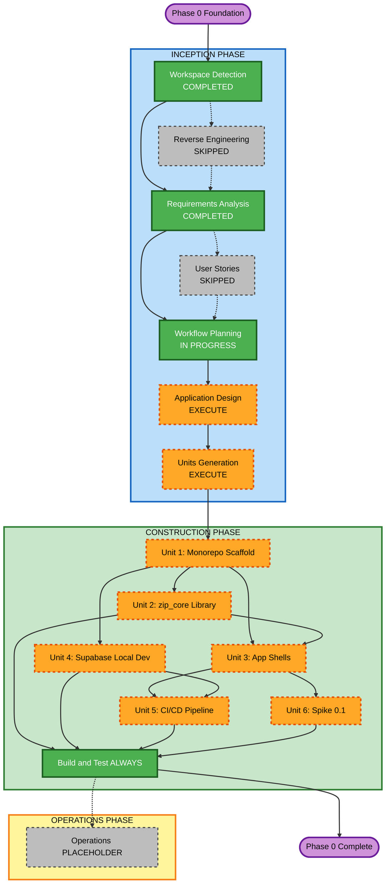

# Execution Plan — Zip Captions v2, Phase 0: Foundation

## Detailed Analysis Summary

### Transformation Scope

- **Type**: Code-greenfield with documentation-brownfield context and PoC migration
- **Primary Changes**: Full monorepo scaffold from scratch across 4 packages + CI/CD + local infrastructure
- **Source Context**: Flutter PoC (`zip_captions_mobile`) using `provider`; v1 PWA (`zip-captions`) for translation assets

### Change Impact Assessment

| Area | Impact | Description |
|---|---|---|
| User-facing changes | Minimal | Hello-world app shells only; no user-facing features |
| Structural changes | High | Establishes entire monorepo architecture that all future phases depend on |
| Data model changes | None | No application data models in Phase 0 |
| API changes | None | No APIs in Phase 0 |
| NFR impact | High | `very_good_analysis`, PBT framework selection, secrets management, CI pipeline security |

### Risk Assessment

- **Risk Level**: Medium
- **Rollback Complexity**: Easy (greenfield — if a unit fails, discard the worktree branch)
- **Testing Complexity**: Moderate (multi-platform Flutter builds, Melos orchestration)

---

## Workflow Visualization

### Mermaid Diagram



### Text Alternative

```
INCEPTION PHASE
  [x] Workspace Detection       COMPLETED
  [ ] Reverse Engineering       SKIPPED (no source code)
  [x] Requirements Analysis     COMPLETED
  [ ] User Stories              SKIPPED (infrastructure work, no user-facing features)
  [x] Workflow Planning         IN PROGRESS
  [ ] Application Design        EXECUTE
  [ ] Units Generation          EXECUTE

CONSTRUCTION PHASE
  Unit 1: Monorepo Scaffold ──────────────────────────────┐
    [ ] Code Generation         EXECUTE                   |
                                                          v
  Unit 2: zip_core Library  (depends on Unit 1) ──────────+──> Unit 3
    [ ] Functional Design       EXECUTE                   |
    [ ] NFR Requirements        EXECUTE                   |
    [ ] NFR Design              EXECUTE                   |
    [ ] Code Generation         EXECUTE                   |
                                                          v
  Unit 3: App Shells        (depends on Units 1+2) ───────+──> Unit 5, Unit 6
    [ ] Code Generation         EXECUTE                   |
                                                          v
  Unit 4: Supabase Local Dev (depends on Unit 1) ─────────+──> Unit 5
    [ ] NFR Requirements        EXECUTE                   |
    [ ] Infrastructure Design   EXECUTE                   |
    [ ] Code Generation         EXECUTE                   |
                                                          v
  Unit 5: CI/CD Pipeline    (depends on Units 3+4) ───────+
    [ ] NFR Requirements        EXECUTE                   |
    [ ] Infrastructure Design   EXECUTE                   |
    [ ] Code Generation         EXECUTE                   |
                                                          v
  Unit 6: Spike 0.1         (depends on Unit 3) ──────────+
    [ ] Code Generation         EXECUTE                   |
                                                          v
  [ ] Build and Test            ALWAYS EXECUTE

OPERATIONS PHASE
  [ ] Operations                PLACEHOLDER
```

---

## Phases to Execute

### INCEPTION PHASE

- [x] Workspace Detection — COMPLETED
- [ ] Reverse Engineering — SKIPPED: No source code to analyze; project docs are the source of truth
- [x] Requirements Analysis — COMPLETED
- [ ] User Stories — SKIPPED: Phase 0 is pure infrastructure scaffolding with no new user-facing behaviour beyond hello-world shells; no personas or acceptance criteria needed
- [x] Workflow Planning — IN PROGRESS (this document)
- [ ] Application Design — EXECUTE: New packages with inter-package dependencies need their component interfaces and dependency graph defined before units can be generated
- [ ] Units Generation — EXECUTE: 6 units of parallel work across 4 packages + CI/CD + spike; decomposition needed to coordinate worktrees

### CONSTRUCTION PHASE (Per-Unit Stage Decisions)

| Unit | Functional Design | NFR Requirements | NFR Design | Infrastructure Design | Code Generation |
|---|---|---|---|---|---|
| Unit 1: Monorepo Scaffold | SKIP | SKIP | SKIP | SKIP | EXECUTE |
| Unit 2: zip_core Library | EXECUTE | EXECUTE | EXECUTE | SKIP | EXECUTE |
| Unit 3: App Shells | SKIP | SKIP | SKIP | SKIP | EXECUTE |
| Unit 4: Supabase Local Dev | SKIP | EXECUTE | SKIP | EXECUTE | EXECUTE |
| Unit 5: CI/CD Pipeline | SKIP | EXECUTE | SKIP | EXECUTE | EXECUTE |
| Unit 6: Spike 0.1 | SKIP | SKIP | SKIP | SKIP | EXECUTE |

**Rationale for each unit:**

**Unit 1 — Monorepo Scaffold**
- FD/NFR/Infra: SKIP — melos.yaml and pubspec configurations are boilerplate; no business logic, no security-critical infrastructure
- Code Gen: EXECUTE — creates root config, melos.yaml, package directory stubs

**Unit 2 — zip_core Library**
- FD: EXECUTE — `RecordingStateProvider` has a state machine (idle/recording/paused/stopped) that needs design; `SettingsProvider` data model needs definition
- NFR: EXECUTE — PBT-09 framework selection (Dart: `glados`); provider test strategy
- NFR Design: EXECUTE — integrate PBT into provider test plan; shrinking/reproducibility for state machine tests
- Infra: SKIP — no infrastructure services
- Code Gen: EXECUTE

**Unit 3 — App Shells**
- FD/NFR/Infra: SKIP — hello-world shell with `ProviderScope`; no business logic, no new NFRs beyond what Unit 2 establishes
- Code Gen: EXECUTE

**Unit 4 — Supabase Local Dev**
- FD: SKIP — empty schema, no application tables
- NFR: EXECUTE — SECURITY-09/12: no credentials in committed files; SECURITY-01: local Postgres should use TLS or document the local-only exception
- Infra: EXECUTE — Docker Compose service definitions, port mapping, volume config
- Code Gen: EXECUTE

**Unit 5 — CI/CD Pipeline**
- FD: SKIP — no business logic
- NFR: EXECUTE — SECURITY-10: pinned SDK/tool versions, lock file in CI; SECURITY-13: pipeline access control via branch protection
- Infra: EXECUTE — GitHub Actions job graph, runner selection, caching strategy
- Code Gen: EXECUTE

**Unit 6 — Spike 0.1**
- FD/NFR/Infra: SKIP — research spike, no code produced
- Code Gen: EXECUTE — produces documentation (PLATFORM_SETUP.md, build findings)

### OPERATIONS PHASE

- [ ] Operations — PLACEHOLDER (no production deployment in Phase 0)

---

## Unit Dependency and Sequencing

### Dependency Graph

```
Unit 1 (Monorepo Scaffold)
  |
  +---> Unit 2 (zip_core) ──────────> Unit 3 (App Shells) ──> Unit 5 (CI/CD)
  |                                                        |
  +---> Unit 3 (App Shells)                                +──> Unit 6 (Spike 0.1)
  |
  +---> Unit 4 (Supabase) ──────────> Unit 5 (CI/CD)
```

### Critical Path

Unit 1 → Unit 2 → Unit 3 → Unit 5 → Build and Test

### Parallelization Opportunities

After Unit 1 is merged:
- **Parallel track A**: Unit 2 (zip_core), then Unit 3 (App Shells)
- **Parallel track B**: Unit 4 (Supabase) — independent, can proceed simultaneously with track A

After Unit 3 is merged:
- Unit 5 (CI/CD) and Unit 6 (Spike 0.1) can proceed in parallel

### Worktree Strategy

Each unit = one git worktree = one feature branch = one PR targeting `develop`.

```bash
# Unit 1
git worktree add ../zip-captions-monorepo-scaffold -b feature/phase0-monorepo-scaffold

# Unit 2
git worktree add ../zip-captions-zip-core -b feature/phase0-zip-core

# Unit 3
git worktree add ../zip-captions-app-shells -b feature/phase0-app-shells

# Unit 4
git worktree add ../zip-captions-supabase -b feature/phase0-supabase-local-dev

# Unit 5
git worktree add ../zip-captions-ci -b feature/phase0-ci-pipeline

# Unit 6
git worktree add ../zip-captions-spike-desktop -b feature/phase0-spike-desktop-builds
```

---

## Success Criteria

**Primary Goal**: Establish the monorepo foundation that all subsequent phases will build on.

**Key Deliverables**:
1. `melos bootstrap` succeeds across all 4 packages
2. `melos run test` passes (all packages have passing test scaffolds)
3. Both apps launch on at least one platform each
4. CI workflows pass on a PR; `analyze` + `test` are required status checks on `main` and `develop`
5. Supabase local stack starts and accepts connections
6. No `provider` dependency remains — Riverpod only
7. Desktop builds verified (macOS, Windows, Linux) and any issues documented

**Quality Gates**:
- Zero `very_good_analysis` warnings across all packages
- No hardcoded secrets in any committed file
- All lock files committed (`pubspec.lock`)
- PBT framework (`glados`) present in `zip_core` dev dependencies

---

## Security Compliance Summary (Workflow Planning Stage)

| Rule | Status | Notes |
|---|---|---|
| SECURITY-01 through SECURITY-08 | N/A | No data stores, APIs, or network configs defined at planning stage |
| SECURITY-09 (Hardening) | Compliant | Plan requires `.env.example` + gitignored `.env` for all secrets |
| SECURITY-10 (Supply Chain) | Compliant | Plan requires pinned SDK, committed lock files, vulnerability scan in CI |
| SECURITY-11 through SECURITY-12 | N/A | No auth or security-critical modules in Phase 0 |
| SECURITY-13 (Integrity) | Compliant | Plan includes branch protection + pipeline access control (Unit 5) |
| SECURITY-14 through SECURITY-15 | N/A | No production deployment or complex logic |

## PBT Compliance Summary (Workflow Planning Stage)

| Rule | Status | Notes |
|---|---|---|
| PBT-01 through PBT-08, PBT-10 | N/A | Design and code stages; will be enforced per-unit in Construction Phase |
| PBT-09 (Framework Selection) | Compliant | `glados` selected for Dart; Unit 2 NFR Requirements will formalize this |
