# Phase 2 Execution Plan — Broadcasting & Transport

## Detailed Analysis Summary

### Transformation Scope
- **Transformation Type**: Major feature addition to an existing brownfield monorepo, plus new backend and infrastructure surface
- **Primary Changes**: Minimal broadcaster authentication, permanent broadcast identity with anonymous resolution, Realtime signaling, WebRTC data-channel transport with self-hosted Coturn, a remote broadcast output target, broadcaster session UI, viewer UI with web route, viewer capacity, and completion of the Phase 1 caption overlay as an external-display output
- **Related Components**: zip_core (new auth, identity, signaling, transport and output-target components), zip_broadcast (sign-in, broadcast setup and dashboard, overlay completion), zip_captions (join and viewer screens, `/b/{id}` route), zip_supabase (migration, RLS, Realtime authorization, possibly an Edge Function), local dev stack (Coturn service)

### Change Impact Assessment
- **User-facing changes**: Yes. New screens in both apps, a public web route, and a new second-display output.
- **Structural changes**: Yes. This is the first networked transport layer. It introduces a transport abstraction (ADR-011) that the Phase 3 relay and the Phase 5 local transports will plug into.
- **Data model changes**: Yes. A broadcast ID registry table (first application table with RLS), signaling message schemas, caption wire format, and viewer and broadcaster session state models.
- **API changes**: Yes. New public zip_core interfaces (auth service, signaling, transport, remote output target) and a new anonymous resolution endpoint. The stable contracts (`SttEngine`, `SttResult`, caption bus, stable URL format, Section 9 channel names) are consumed unchanged.
- **NFR impact**: Yes. Sub-second remote latency, 100-200 viewer fan-out, zero-retention on servers, enumeration resistance, security-critical pre-approvals, PBT for protocols and state machines, and WCAG AAA with screen-reader state announcements.

### Component Relationships
```
zip_supabase
  ├── migration: broadcast ID registry + RLS          (SR-02)
  ├── anonymous resolution path (RPC/view or Edge Fn) (SR-02)
  ├── Realtime channel authorization                  (SR-02)
  └── local stack: Coturn service + TURN credentials  (SR-03)

zip_core (foundation, consumed by both apps)
  ├── Auth service abstraction (GoTrue)               (SR-01)
  ├── Broadcast identity client (get/create, resolve)
  ├── Signaling (status + signaling channels, presence)
  ├── Transport abstraction + WebRTC implementation
  ├── Remote broadcast CaptionOutputTarget (sender)
  ├── Remote caption source into viewer caption bus (receiver)
  └── Capacity admission

zip_broadcast ── depends on zip_core
  ├── Sign-in UI
  ├── Broadcast setup + live dashboard
  └── CaptionOverlayTarget completion (external display)

zip_captions ── depends on zip_core
  ├── Join screen + live viewer states
  └── Web route /b/{broadcast_id}
```

| Component | Change Type | Priority |
|---|---|---|
| zip_supabase | Major (first app schema, RLS, Realtime authz) | Critical |
| zip_core | Major (new public interfaces) | Critical |
| zip_broadcast | Major (new screens; overlay completion) | Important |
| zip_captions | Major (new screens; web route) | Important |
| Local dev stack / CI | Minor (add Coturn service) | Important |

### Risk Assessment
- **Risk Level**: High
- **Key Risks**: Broadcaster fan-out capacity on desktop and web (Spike 2.1); `flutter_webrtc` data-channel maturity on Windows and Linux (Spike 2.1); TURN through symmetric NAT and the credential mechanism (Spike 2.3); OAuth redirect handling on desktop platforms (SR-01); RLS and Realtime authorization correctness on a public surface (SR-02); display enumeration possibly needing a new dependency (S-20)
- **Rollback Complexity**: Moderate. Remote broadcasting is additive behind sign-in, and local features are untouched and guarded by M-REG-01. The migration is forward-only.
- **Testing Complexity**: Complex. Multi-device, NAT simulation, load measurement, PBT for protocols and state machines, and integration against the local Supabase stack.

---

## Workflow Visualization

```mermaid
flowchart TD
    Start(["Phase 2 Request"])

    subgraph INCEPTION["INCEPTION PHASE"]
        WD["Workspace Detection<br/><b>COMPLETED</b>"]
        RE["Reverse Engineering<br/><b>SKIP</b>"]
        RA["Requirements Analysis<br/><b>COMPLETED</b>"]
        US["User Stories<br/><b>COMPLETED</b>"]
        WP["Workflow Planning<br/><b>IN PROGRESS</b>"]
        AD["Application Design<br/><b>EXECUTE</b>"]
        UG["Units Generation<br/><b>EXECUTE</b>"]
    end

    subgraph CONSTRUCTION["CONSTRUCTION PHASE"]
        SP["Spikes 2.1, 2.2, 2.3<br/><b>EXECUTE</b>"]
        FD["Functional Design<br/><b>EXECUTE per unit</b>"]
        NFRA["NFR Requirements<br/><b>EXECUTE per unit</b>"]
        NFRD["NFR Design<br/><b>EXECUTE per unit</b>"]
        ID["Infrastructure Design<br/><b>CONDITIONAL</b>"]
        CG["Code Generation<br/><b>EXECUTE</b>"]
        BT["Build and Test<br/><b>EXECUTE</b>"]
        DR["Documentation Refinement<br/><b>EXECUTE</b>"]
    end

    subgraph OPERATIONS["OPERATIONS PHASE"]
        OPS["Operations<br/><b>SKIP</b>"]
    end

    Start --> WD
    WD --> RA
    RA --> US
    US --> WP
    WP --> AD
    AD --> UG
    UG --> SP
    SP --> FD
    FD --> NFRA
    NFRA --> NFRD
    NFRD --> ID
    ID --> CG
    CG --> BT
    BT --> DR
    DR --> End(["Phase 2 Complete"])

    style WD fill:#4CAF50,stroke:#1B5E20,stroke-width:3px,color:#fff
    style RA fill:#4CAF50,stroke:#1B5E20,stroke-width:3px,color:#fff
    style US fill:#4CAF50,stroke:#1B5E20,stroke-width:3px,color:#fff
    style WP fill:#4CAF50,stroke:#1B5E20,stroke-width:3px,color:#fff
    style RE fill:#BDBDBD,stroke:#424242,stroke-width:2px,stroke-dasharray: 5 5,color:#000
    style OPS fill:#BDBDBD,stroke:#424242,stroke-width:2px,stroke-dasharray: 5 5,color:#000
    style AD fill:#FFA726,stroke:#E65100,stroke-width:3px,stroke-dasharray: 5 5,color:#000
    style UG fill:#FFA726,stroke:#E65100,stroke-width:3px,stroke-dasharray: 5 5,color:#000
    style SP fill:#FFA726,stroke:#E65100,stroke-width:3px,stroke-dasharray: 5 5,color:#000
    style FD fill:#FFA726,stroke:#E65100,stroke-width:3px,stroke-dasharray: 5 5,color:#000
    style NFRA fill:#FFA726,stroke:#E65100,stroke-width:3px,stroke-dasharray: 5 5,color:#000
    style NFRD fill:#FFA726,stroke:#E65100,stroke-width:3px,stroke-dasharray: 5 5,color:#000
    style ID fill:#FFA726,stroke:#E65100,stroke-width:3px,stroke-dasharray: 5 5,color:#000
    style CG fill:#4CAF50,stroke:#1B5E20,stroke-width:3px,color:#fff
    style BT fill:#4CAF50,stroke:#1B5E20,stroke-width:3px,color:#fff
    style DR fill:#4CAF50,stroke:#1B5E20,stroke-width:3px,color:#fff
    style Start fill:#CE93D8,stroke:#6A1B9A,stroke-width:3px,color:#000
    style End fill:#CE93D8,stroke:#6A1B9A,stroke-width:3px,color:#000

    linkStyle default stroke:#333,stroke-width:2px
```



**Text alternative:** Inception runs Workspace Detection, Requirements Analysis and User Stories (completed), Workflow Planning (in progress), then Application Design and Units Generation (both execute). Reverse Engineering is skipped. Construction runs Spikes 2.1-2.3 first, then per unit Functional Design, NFR Requirements, NFR Design, Infrastructure Design (where needed) and Code Generation, then Build and Test and Documentation Refinement. Operations is skipped.

---

## Phases to Execute

### INCEPTION PHASE
- [x] Workspace Detection — COMPLETE
- [x] Reverse Engineering — SKIPPED (codebase built by AI-DLC; design artifacts current; targeted brownfield checks done inline, e.g. the S-20 overlay finding)
- [x] Requirements Analysis — COMPLETE (10 FRs, 8 NFR groups, 3 spikes)
- [x] User Stories — COMPLETE (10 stories, 3 security reviews, 6 prototypes, 4 milestones)
- [x] Workflow Planning — IN PROGRESS
- [ ] Application Design — **EXECUTE**
  - **Rationale**: Many new components with interfaces that cross package boundaries: auth service, identity client, signaling, transport abstraction, WebRTC implementation, remote output target and receiver, capacity admission, and TURN credential issuance. The transport abstraction must be shaped now so the Phase 3 relay and the Phase 5 local transports fit without rework (FR-4.7).
- [ ] Units Generation — **EXECUTE**
  - **Rationale**: 10 stories, 3 review gates, 6 prototypes and 3 spikes need sequencing into units with clear gates and parallel lanes.

### CONSTRUCTION PHASE (per unit)

Stages are assessed per unit. This is the default; the per-unit stages in the proposal below are preliminary and are finalized in Units Generation.

- [ ] Research Spikes 2.1, 2.2, 2.3 — **EXECUTE** (early units, before their dependents)
- [ ] Functional Design — **EXECUTE** where business logic exists
  - **Rationale**: Session and viewer state machines, signaling protocol, wire format, ID generation, capacity admission, reconnection, OAuth flow design (SR-01), RLS and authorization policy (SR-02). Skipped for the prototype and Coturn units.
- [ ] NFR Requirements — **EXECUTE** for most units
  - **Rationale**: The Security Baseline and PBT extensions become active here. The rule files are loaded at the first such stage per `aidlc-project-rules/common/session-protocol.md`. Latency, scale, zero-retention and accessibility targets apply.
- [ ] NFR Design — **EXECUTE** where NFR Requirements executed
  - **Rationale**: PBT generators for adversarial signaling, load-test harness from Spike 2.1, enumeration controls, and reconnection timing.
- [ ] Infrastructure Design — **CONDITIONAL**
  - **Rationale**: EXECUTE for the identity/signaling unit (migration, RLS, Realtime authorization, resolution endpoint), the Coturn unit (service, credentials, log config per SR-03, metrics), and the external-display unit (secondary-window entry point, display enumeration; Phase 1 precedent for the overlay). SKIP elsewhere.
- [ ] Code Generation — **EXECUTE** (always, per unit)
- [ ] Build and Test — **EXECUTE** (after all units; milestones M-S2.2, M-S2.3, M-S3.6, M-REG-01)
- [ ] Documentation Refinement — **EXECUTE** (after Build and Test; applies the roadmap, spec, ADR-011, persona S3.6 and AGENTS.md updates listed in the requirements)

### OPERATIONS PHASE
- [ ] Operations — **SKIP** (AI-DLC placeholder). Coturn is delivered for the local dev stack, with deployment configuration documented in Infrastructure Design. Production VPS deployment and domain hosting for `zipcaptions.app/b/{id}` are outside Phase 2 Construction (requirements assumption 4).

---

## Proposed Construction Units (preliminary; finalized in Units Generation)

### Early Units: Research Spikes

| Unit | Description | Feeds |
|---|---|---|
| Spike 2.1 | Broadcaster fan-out (desktop incl. Windows or Linux, and web) up to 200 data channels; Realtime signaling and presence load at 200 joins | Viewer cap, NFR-1.3 timings, presence timeout; Units 3, 5 |
| Spike 2.2 | OBS closed-caption API confirmation against `ObsWebSocketTarget` | FR-10; follow-up only if a gap is found |
| Spike 2.3 | Coturn alongside Supabase: config, ephemeral credentials, log config, symmetric NAT, load | Unit 4 |

### Construction Units

| Unit | Stories / Gates | Package(s) | Stages | Depends on |
|---|---|---|---|---|
| 1: UI Prototypes | Proto-10..15 | aidlc-docs (HTML/CSS) | CG only, human review gate | — (start immediately) |
| 2: Broadcaster Auth | S-15, SR-01 | zip_core, zip_broadcast | FD (with SR-01), NFR-R, NFR-D, CG | Proto-10 |
| 3: Broadcast Identity + Signaling | S-11, S-13, SR-02 | zip_supabase, zip_core | FD (with SR-02), NFR-R, NFR-D, ID, CG | Unit 2, Spike 2.1 |
| 4: Coturn Infrastructure | S-12, SR-03 | local stack, zip_core config | NFR-R, NFR-D, ID (with SR-03), CG | Spike 2.3 |
| 5: WebRTC Transport + Remote Output | S-14, S-16, S-18 | zip_core | FD, NFR-R, NFR-D, CG | Units 3, 4, Spike 2.1 |
| 6: Zip Broadcast Broadcast UI | S-17 | zip_broadcast | FD, NFR-R, CG | Unit 5, Proto-11, Proto-12 |
| 7: Zip Captions Viewer | S-19 | zip_captions | FD, NFR-R, NFR-D, CG | Unit 5, Proto-14, Proto-15 |
| 8: External Display | S-20 | zip_broadcast | FD, ID, CG | Proto-13 |
| 9: Integration Milestones | M-S2.2, M-S2.3, M-S3.6, M-REG-01 | all | Build and Test, Doc Refinement | Units 1-8 |

### Unit Dependency Graph

```
 Spike 2.1        Spike 2.3        Spike 2.2 (independent; FR-10 only)
     |                |
     |   Unit 1: UI Prototypes (starts immediately)
     |       |            |              |              |
     |    Proto-10   Proto-11/12    Proto-14/15      Proto-13
     |       |            |              |              |
     |       v            |              |              v
     |   Unit 2: Auth     |              |      Unit 8: External
     |       |            |              |      Display (parallel)
     v       v            |              |              |
   Unit 3: Identity       |              |              |
   + Signaling            |              |              |
          |      Unit 4: Coturn          |              |
          |          |                   |              |
          v          v                   |              |
   Unit 5: WebRTC Transport              |              |
   + Remote Output + Capacity            |              |
          |          |                   |              |
          v          v                   v              |
   Unit 6: ZB Broadcast UI   Unit 7: ZC Viewer          |
          |                         |                   |
          +-------------+-----------+-------------------+
                        v
          Unit 9: Integration Milestones
          (Build and Test + Documentation Refinement)
```

**Parallel lanes:** Unit 1 and all three spikes start together. Unit 4 (after Spike 2.3) runs in parallel with Units 2-3. Unit 8 runs in parallel with the entire broadcast chain once Proto-13 is approved. Units 6 and 7 run in parallel after Unit 5.

**Workflow note:** per project memory, units are built one branch at a time in the main checkout (no worktrees). "Parallel" means the order is flexible, not that units are built simultaneously.

---

## Package Change Sequence

1. **zip_supabase**: schema, RLS and Realtime authorization first, because every networked client depends on them (Unit 3)
2. **Local stack**: Coturn service and credentials (Unit 4)
3. **zip_core**: auth (Unit 2), then identity and signaling clients (Unit 3), then transport, output target and capacity (Unit 5)
4. **zip_broadcast and zip_captions**: UI consumers (Units 6, 7). The overlay completion (Unit 8) is independent.

**Coordination points:** signaling message schema and caption wire format (versioned JSON shared by both apps through zip_core); Section 9 channel names; the resolution endpoint's response shape. **Testing checkpoints:** zip_core protocol PBT at Unit 3 and Unit 5; local-stack integration tests at Units 3-5; two-device and NAT tests at Unit 9.

---

## Success Criteria

- **Primary Goal**: A signed-in broadcaster on Zip Broadcast shares a permanent link, and anonymous viewers on any Zip Captions platform receive live captions over WebRTC, with TURN fallback, automatic reconnection and a capacity cap. Captions can also be shown on a second display.
- **Key Deliverables**: Stories S-11 to S-20; approved reviews SR-01 to SR-03; approved prototypes Proto-10 to Proto-15; spike reports 2.1 to 2.3; milestones M-S2.2, M-S2.3, M-S3.6, M-REG-01 passing
- **Quality Gates**: 80%+ coverage per package; PBT per the extension targets; zero analyzer issues; all CI checks green; Security Baseline compliance summary per stage; no caption content in any log (app, Coturn, Realtime)
- **Integration Testing**: Two-device P2P on the same network; TURN under restricted-NAT simulation; capacity refusal at the cap; reconnection after network change
- **Operational Readiness**: Coturn metrics and alert thresholds defined; server log configuration matches the approved SR-03
- **Phase 2 Exit Criteria**: As revised in `phase2-requirements.md`
